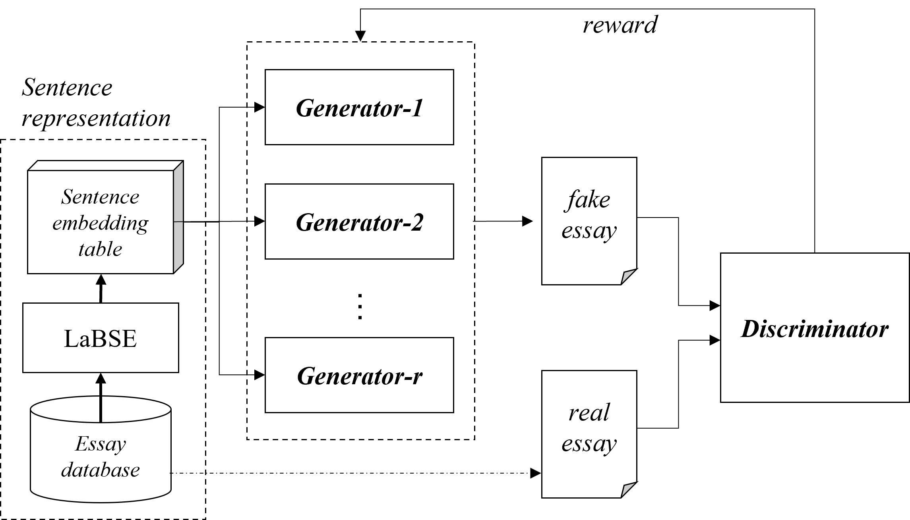

# EssayGAN-PyTorch

## Implementation Details

### SeqGAN

- run file: [run_essaygan.py]()

- Instructors: [real_data](instructor/real_data/essaygan_instructor.py)

- Models: [generator](models/EssayGAN_G.py), [discriminator](models/EssayGAN_D.py)

- Structure (from [EssayGAN]())

  

## Requirements Library
TextGAN https://github.com/williamSYSU/TextGAN-PyTorch